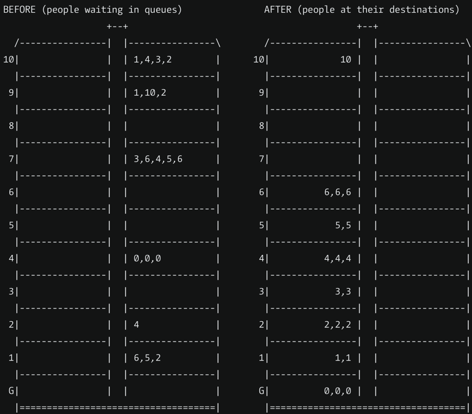

# elevator_kata

#Simulate a lift in the building
https://www.codewars.com/kata/58905bfa1decb981da00009e

A multi-floor building has a Lift in it.

People are queued on different floors waiting for the Lift.

Some people want to go up. Some people want to go down.

The floor they want to go to is represented by a number (i.e. when they enter the Lift this is the button they will
press)

